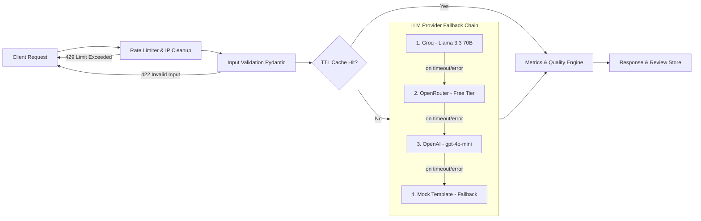

# 🥗 Healthy Gut AI

**Production-grade AI content engine for medically-grounded, SEO-optimized gut health articles.**

[](https://github.com/Shweta-Mishra-ai/Healthy-Gut-AI/actions/workflows/ci.yml)
[](https://www.python.org/)
[](https://fastapi.tiangolo.com/)
[](https://console.groq.com)
[](LICENSE)
[](tests/)

[Quick Start](#-quick-start) · [Architecture](#-architecture) · [API Reference](#-api-reference) · [Deployment](#-deployment) · [Contributing](CONTRIBUTING.md)

---

## Overview

Healthy Gut AI takes a topic, a primary keyword, and a geo-target, and returns a medically-grounded, SEO-structured article — complete with meta description variants, URL slug, FAQs, JSON-LD schema, readability metrics, and medical quality scores — in a single request.

It's built the way a production content pipeline should be:

- **High Concurrency & Load Handling**: Configured for up to 5,000 users/day with SQLite WAL mode, `busy_timeout=10000`, `synchronous=NORMAL`, and automatic rate-limiter memory cleanup.
- **No Single Point of Failure**: A three-provider LLM fallback chain (Groq → OpenRouter → OpenAI → Mock) ensures provider outages never bring down the app.
- **Fails Safely, Not Silently**: Structured error codes, request validation, and comprehensive exception handling middleware.
- **Tested & Verified**: 150 automated tests covering unit, integration, RAG similarity, security, export, and concurrent load scenarios.

---

## ✨ Features

| Category | Capability |
|---|---|
| **Generation** | Single-article and batch (multi-topic, bounded-concurrency) generation |
| **Topic Scoping** | Rejects out-of-scope requests (e.g. quantum computing) with structured 422 responses |
| **Length Compliance** | Section-level word budgeting for pillar (2500+ words) and supporting (1000+ words) articles |
| **Quality Scoring** | Programmatic 0-100 score evaluating word count, keyword density, meta length, and disclaimer presence |
| **Human Review** | Draft approval workflow (`/review`) with medical reviewer credential badges |
| **High Load Readiness** | SQLite WAL mode + busy timeout, TTL cache eviction, and stale IP garbage collection |
| **Internal Linking** | TF-IDF similarity ranking to suggest internal links across approved articles |
| **WordPress Publishing** | Optional WP REST API integration with dry-run payload verification |
| **Modern UI & UX** | Glassmorphism, dark/light theme toggle, toast notifications, outline previewer, and copy alerts |
| **Export Formats** | Download articles as formatted `.docx`, `.pdf` (with smart quote sanitization), `.md`, `.json`, or batch `.zip` |

---

## 🏗 Architecture



---

## 🧱 Tech Stack

| Layer | Technology |
|---|---|
| **Backend** | Python 3.11+, FastAPI, Uvicorn |
| **LLM Providers** | Groq (free), OpenRouter (free tier), OpenAI (optional) |
| **Database** | SQLite3 with WAL mode & busy timeout pragmas |
| **Validation** | Pydantic v2 |
| **Frontend** | Vanilla JS, Marked.js, DOMPurify, CSS Glassmorphism, Theme Switcher |
| **Export** | `python-docx`, `fpdf2` |
| **Testing** | Pytest, pytest-asyncio, httpx |

---

## 🚀 Quick Start

### 1. Clone and Install

```bash
git clone https://github.com/Shweta-Mishra-ai/Healthy-Gut-AI.git
cd Healthy-Gut-AI/hga
python -m venv venv
source venv/bin/activate        # Windows: venv\Scripts\activate
pip install -r requirements.txt
```

### 2. Configure Environment

```bash
cp .env.example .env
```

Edit `.env` (optional, defaults to mock mode if no API key is provided):

```env
GROQ_API_KEY=gsk_your_key_here
```

### 3. Run Locally

```bash
uvicorn app.main:app --reload --port 8000
```

Open **http://localhost:8000** in your browser.

---

## 🧪 Testing & Load Verification

Run the complete 150-test suite directly:

```bash
python -m pytest
```

Output:
```
======================= 150 passed in 4.15s =======================
```

---

## 📄 License

Released under the [MIT License](LICENSE).
