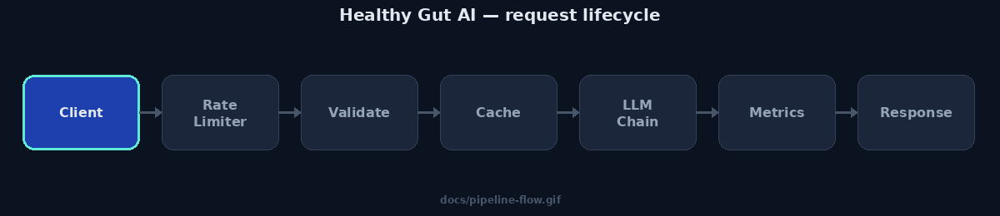
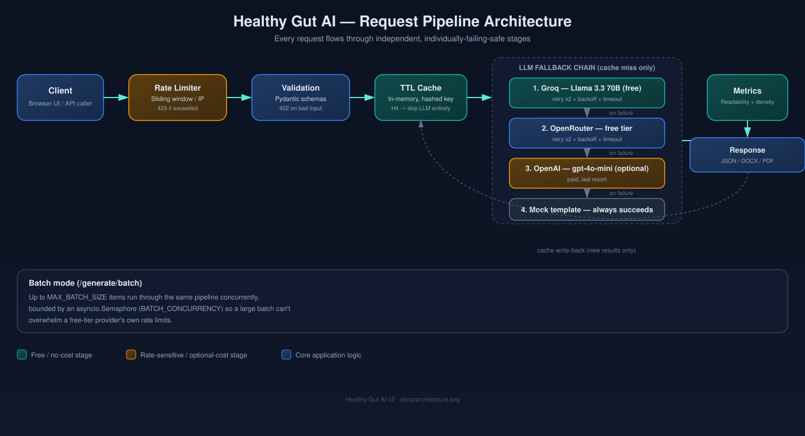
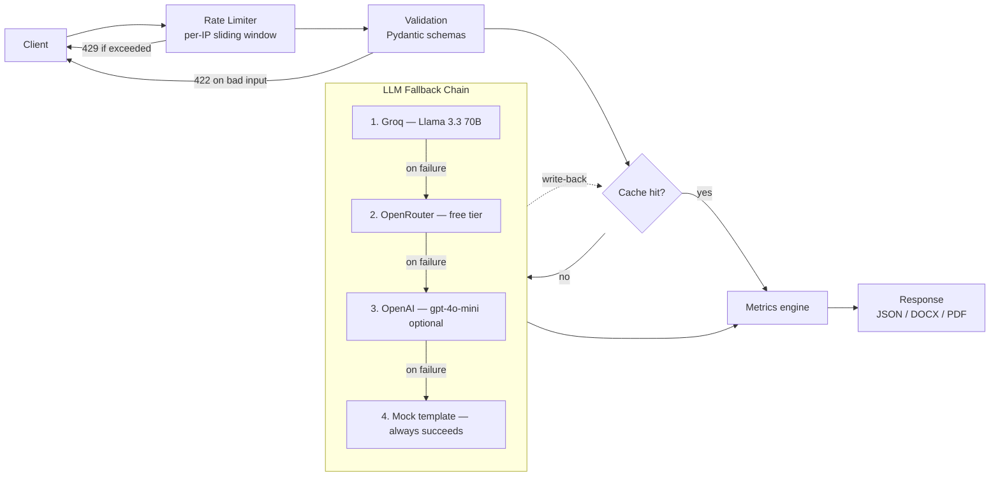
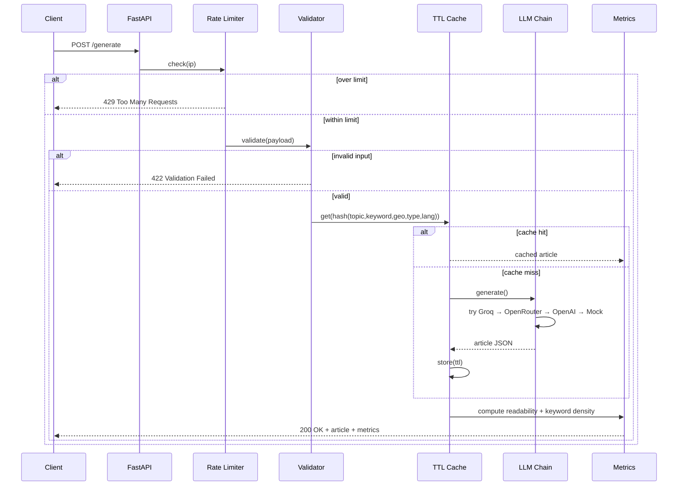
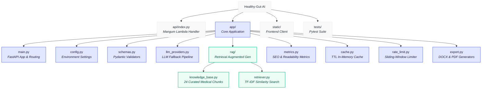

<div align="center">

# 🥗 Healthy Gut AI

**Production-grade AI content engine for medically-grounded, SEO-optimized gut health articles.**

[](https://github.com/Shweta-Mishra-ai/Healthy-Gut-AI/actions/workflows/ci.yml)
[](https://www.python.org/)
[](https://fastapi.tiangolo.com/)
[](https://console.groq.com)
[](LICENSE)
[](tests/)
[](https://github.com/Shweta-Mishra-ai/Healthy-Gut-AI)

⭐️ **Show your support by starring the repo if you like it!** ⭐️

[Quick Start](#-quick-start) · [Architecture](#-architecture) · [Codebase Map](#-codebase-map) · [API Reference](#-api-reference) · [Deployment](#-deployment) · [Contributing](CONTRIBUTING.md)

</div>

---

## Overview

Healthy Gut AI takes a topic, a primary keyword, and a geo-target, and returns
a medically-grounded, SEO-structured article — complete with meta description,
URL slug, FAQs, JSON-LD schema, and quality metrics — in one request.

It's built the way a production content pipeline should be, not the way a
demo usually is:

- **No single point of failure.** A three-provider LLM fallback chain (two of
  them free) means one API outage never takes the app down.
- **Fails safely, not silently.** Structured error codes, not generic 500s.
- **Costs nothing to run at small scale.** Default provider is Groq's free
  tier; OpenAI is an optional, last-resort fallback you control.
- **Tested, not just written.** 35 automated tests, CI on every push.

<p align="center">
  
</p>

---

## ✨ Features

| Category | Capability |
|---|---|
| **Generation** | Single-article and batch (multi-topic, bounded-concurrency) generation |
| **Reliability** | Groq → OpenRouter → OpenAI → Mock fallback chain, each with retry + backoff + timeout |
| **Validation** | Strict Pydantic schemas — length limits, empty/whitespace rejection, unsafe-character rejection |
| **Rate limiting** | Per-IP sliding-window limiter, configurable via `RATE_LIMIT_PER_MINUTE` |
| **Caching** | In-memory TTL cache — identical requests skip the LLM call entirely |
| **Security** | DOMPurify-sanitized markdown rendering on the frontend (XSS-safe) |
| **Localization** | English and Hindi article generation |
| **RAG retrieval** | TF-IDF similarity search over a 24-topic curated gut-health knowledge base — real relevance ranking, not keyword lookup; `/rag/preview` exposes matches + scores |
| **Export** | Download generated articles as `.docx` or `.pdf` |
| **Quality metrics** | Flesch Reading Ease + keyword density on every article |
| **SEO metadata** | Meta description, URL slug, FAQs, `schema.org` JSON-LD, dual CTAs |
| **Observability** | Structured request logging, `/health` reports live provider config + cache stats |
| **Deployability** | Railway (`Procfile`) and Vercel/AWS Lambda (`api/index.py` via Mangum) out of the box |

---

## 🏗 Architecture

<p align="center">
  
</p>

### Request pipeline (flowchart)



### Request lifecycle (sequence)



---

## 🧱 Tech Stack

| Layer | Technology |
|---|---|
| Backend | Python 3.11+, FastAPI, Uvicorn |
| LLM providers | Groq (free), OpenRouter (free tier), OpenAI (optional) — via OpenAI-compatible client |
| Validation | Pydantic v2 |
| Frontend | Vanilla JS, Marked.js (markdown render), DOMPurify (sanitization), CSS glassmorphism |
| Export | `python-docx`, `fpdf2` |
| Testing | pytest, httpx, FastAPI `TestClient` |
| CI/CD | GitHub Actions |
| Deployment | Railway (`Procfile`) · Vercel/AWS Lambda (`Mangum`) |

---

## 🚀 Quick Start

### Prerequisites

- Python 3.11 or 3.12
- (Optional but recommended) A free [Groq API key](https://console.groq.com)

### 1. Clone and install

```bash
git clone https://github.com/Shweta-Mishra-ai/Healthy-Gut-AI.git
cd Healthy-Gut-AI
python -m venv venv
source venv/bin/activate        # Windows: venv\Scripts\activate
pip install -r requirements.txt
```

### 2. Configure environment

```bash
cp .env.example .env
```

Edit `.env` — at minimum:

```env
GROQ_API_KEY=gsk_your_key_here
```

> No key set? The app runs in **mock mode** automatically — fully functional
> for local development and demos, zero cost, zero setup.

### 3. Run

```bash
uvicorn app.main:app --reload --port 8000
```

Open **http://localhost:8000**.

### 4. Verify it's healthy

```bash
curl http://localhost:8000/health
```

```json
{
  "status": "ok",
  "mode": "live",
  "providers_configured": { "groq": true, "openrouter": false, "openai": false },
  "cache": { "entries": 0, "max_entries": 500, "ttl_seconds": 3600 }
}
```

---

## 🔑 Environment Variables

Full reference in [`.env.example`](.env.example).

| Variable | Required | Default | Description |
|---|---|---|---|
| `GROQ_API_KEY` | No* | — | Primary LLM provider, free tier |
| `GROQ_MODEL` | No | `llama-3.3-70b-versatile` | Groq model name |
| `OPENROUTER_API_KEY` | No* | — | Free-tier fallback if Groq is unavailable |
| `OPENROUTER_MODEL` | No | `meta-llama/llama-3.3-70b-instruct:free` | OpenRouter model name |
| `OPENAI_API_KEY` | No | — | Optional paid last-resort fallback |
| `OPENAI_MODEL` | No | `gpt-4o-mini` | OpenAI model name |
| `LLM_TIMEOUT_SECONDS` | No | `45` | Per-attempt timeout |
| `LLM_MAX_RETRIES` | No | `2` | Retries per provider before falling through |
| `RATE_LIMIT_PER_MINUTE` | No | `10` | Requests per IP per minute on `/generate*` |
| `CACHE_TTL_SECONDS` | No | `3600` | How long identical requests are served from cache |
| `MAX_BATCH_SIZE` | No | `10` | Max items per `/generate/batch` call |
| `BATCH_CONCURRENCY` | No | `3` | Concurrent LLM calls within a batch |
| `API_KEY` | No | — | If set, requires `X-API-Key` header on `/generate*`, `/export/*`, `/debug` |

*No provider key is required — the app runs in mock mode without any of them.*

---

## 📡 API Reference

| Method | Endpoint | Description |
|---|---|---|
| `GET` | `/` | Frontend UI |
| `GET` | `/health` | Status, active mode, provider config, cache stats |
| `GET` | `/debug` | Lists all registered routes |
| `GET` | `/rag/preview?topic=...&keyword=...` | Shows which knowledge-base chunks are retrieved for a query, with similarity scores |
| `POST` | `/generate` | Generate one article |
| `POST` | `/generate/batch` | Generate up to `MAX_BATCH_SIZE` articles concurrently |
| `POST` | `/export/docx` | Generate (or reuse cache) and return as `.docx` |
| `POST` | `/export/pdf` | Generate (or reuse cache) and return as `.pdf` |

### `POST /generate`

**Request**

```json
{
  "topic": "IBS diet plan",
  "primary_keyword": "IBS diet",
  "geo_target": "India",
  "article_type": "supporting",
  "language": "en"
}
```

**Response — `200 OK`**

```json
{
  "optimized_article_markdown": "# IBS Diet Plan...",
  "meta_description": "Learn about IBS diet with our expert guide...",
  "url_slug": "ibs-diet-plan-guide",
  "faqs": [{ "question": "...", "answer": "..." }],
  "schema_json_ld": { "@context": "https://schema.org", "@type": "Article" },
  "cta_soft": "Explore more free gut health resources...",
  "cta_direct": "Try Healthy Gut AI FREE today...",
  "provider_used": "groq",
  "cached": false,
  "metrics": {
    "readability": { "fleschReadingEase": 62.4 },
    "keywordDensity": { "totalWords": 940, "keywordCount": 12, "keywordDensityPercent": 1.28 }
  }
}
```

**Error responses**

| Status | Meaning |
|---|---|
| `422` | Validation failed — see `details` array for field-level errors |
| `429` | Rate limit exceeded — see `retry_after_seconds` |
| `502` | All LLM providers failed for this request |
| `500` | Unexpected server error |

### `POST /generate/batch`

```json
{ "items": [ { "topic": "...", "primary_keyword": "...", "geo_target": "..." } ] }
```

Returns `{ "results": [...], "total": N, "succeeded": N, "failed": N }` — a
failure in one item never fails the whole batch.

---

## 🧪 Testing

```bash
python -m pytest tests/ -v
```

35 tests across five suites:

| Suite | Covers |
|---|---|
| `tests/test_metrics.py` | Readability/keyword-density edge cases (empty text, empty keyword, multi-word keywords) |
| `tests/test_schemas.py` | Input validation (length limits, unsafe characters, batch size limits) |
| `tests/test_rag.py` | Retrieval quality — relevant queries rank the correct topic first, different queries return different results, empty/nonsense queries fall back gracefully |
| `tests/test_security.py` | Optional API-key auth (blocked/allowed), disclaimer safety-net (always present, appended if missing, not duplicated) |
| `tests/test_api.py` | Full request lifecycle in mock mode — health, generation, caching, batching, rate limiting |

CI (`.github/workflows/ci.yml`) runs the full suite on Python 3.11 and 3.12
on every push and pull request.

---

## 📦 Codebase Map

### Architecture Flowchart


### Directory Structure

```
Healthy-Gut-AI/
├── app/
│   ├── main.py            # Routes, middleware, logging
│   ├── config.py          # Environment-driven settings
│   ├── schemas.py          # Pydantic request/response models
│   ├── llm_providers.py    # Groq → OpenRouter → OpenAI → Mock fallback chain
│   ├── metrics.py          # Readability + keyword density
│   ├── cache.py             # In-memory TTL cache
│   ├── rate_limit.py        # In-memory sliding-window limiter
│   ├── export.py            # DOCX / PDF generation
│   └── rag/
│       ├── knowledge_base.py  # 24-topic curated gut-health corpus
│       └── retriever.py       # TF-IDF similarity retrieval
├── api/
│   └── index.py             # Mangum wrapper for Vercel/AWS Lambda
├── static/                  # Frontend (HTML/CSS/JS)
├── tests/                   # pytest suite
├── docs/
│   ├── architecture.svg     # Full pipeline diagram
│   └── pipeline-flow.gif    # Animated request-lifecycle illustration
├── prompts/                 # Reference prompt templates
├── .github/workflows/ci.yml
├── requirements.txt
├── Procfile                 # Railway deployment
├── .env.example
├── CONTRIBUTING.md
└── LICENSE
```

---

## 🌐 Deployment

### Railway

1. Push to GitHub, connect the repo in Railway.
2. Set environment variables (at minimum `GROQ_API_KEY`) under **Variables**.
3. Railway auto-detects `Procfile` — no further config needed.

### Vercel / AWS Lambda

`api/index.py` wraps the FastAPI app with [Mangum](https://mangum.io/) for
serverless execution — deploy as-is on Vercel's Python runtime or package for
Lambda.

---

## ⚠️ Known Limitations

Documented honestly rather than hidden:

- **Cache and rate limiter are in-memory** — correct for a single instance,
  but reset on restart and aren't shared across workers/dynos. Swap for Redis
  before scaling horizontally.
- **API-key auth is optional and off by default** — set `API_KEY` before
  exposing this publicly at any real scale; without it, anyone with the URL
  can generate articles up to the rate limit. Once set, `/generate*`,
  `/export/*`, and `/debug` all require an `X-API-Key` header.
- **DOCX/PDF export skip markdown tables** rather than mis-rendering them —
  a dedicated table renderer is a good next contribution.
- **RAG uses TF-IDF, not neural embeddings** — a deliberate tradeoff for a
  24-chunk corpus (no `torch`/vector-DB dependency, fast to install and run
  anywhere). Real relevance ranking, not keyword matching — see `/rag/preview`
  to inspect it — but if the knowledge base grows past a few hundred chunks,
  swap in `sentence-transformers` + Chroma/pgvector; `build_rag_context()`'s
  interface won't need to change for callers.
- **Knowledge base is 24 topics** (IBS, IBD, GERD, Celiac, SIBO, microbiome,
  FODMAP, and more) — solid coverage for common gut-health content, but
  narrower/rarer conditions will fall back to the closest general match
  rather than a perfect one. Add chunks in `app/rag/knowledge_base.py`
  (no retriever code changes needed).

See [`CONTRIBUTING.md`](CONTRIBUTING.md#known-gaps-that-are-good-first-contributions)
for how to help close these.

---

## 🤝 Contributing

Contributions are welcome — see [`CONTRIBUTING.md`](CONTRIBUTING.md) for the
local setup, coding standards, and PR checklist.

## 📄 License

Released under the [MIT License](LICENSE).

---

<div align="center">

**If Healthy Gut AI was useful to you, please consider giving it a ⭐ —**
**it genuinely helps the project reach more people.**

[](https://github.com/Shweta-Mishra-ai/Healthy-Gut-AI)

</div>
