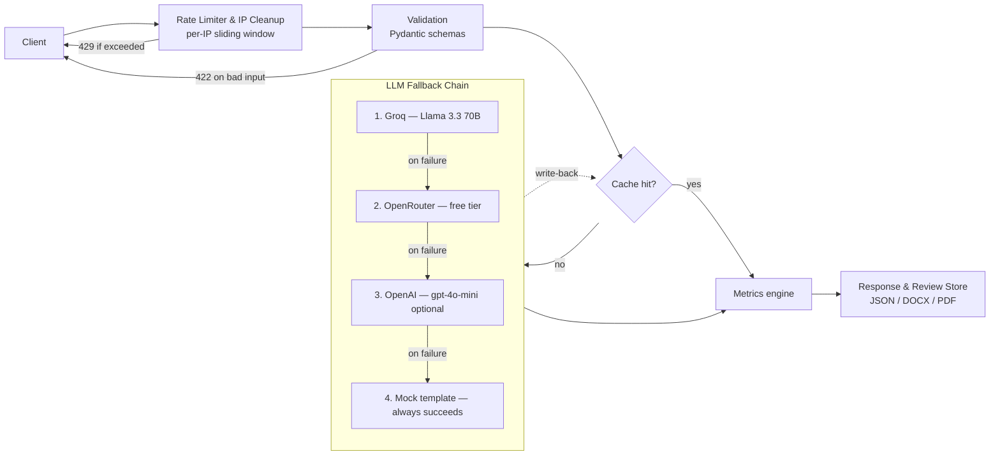
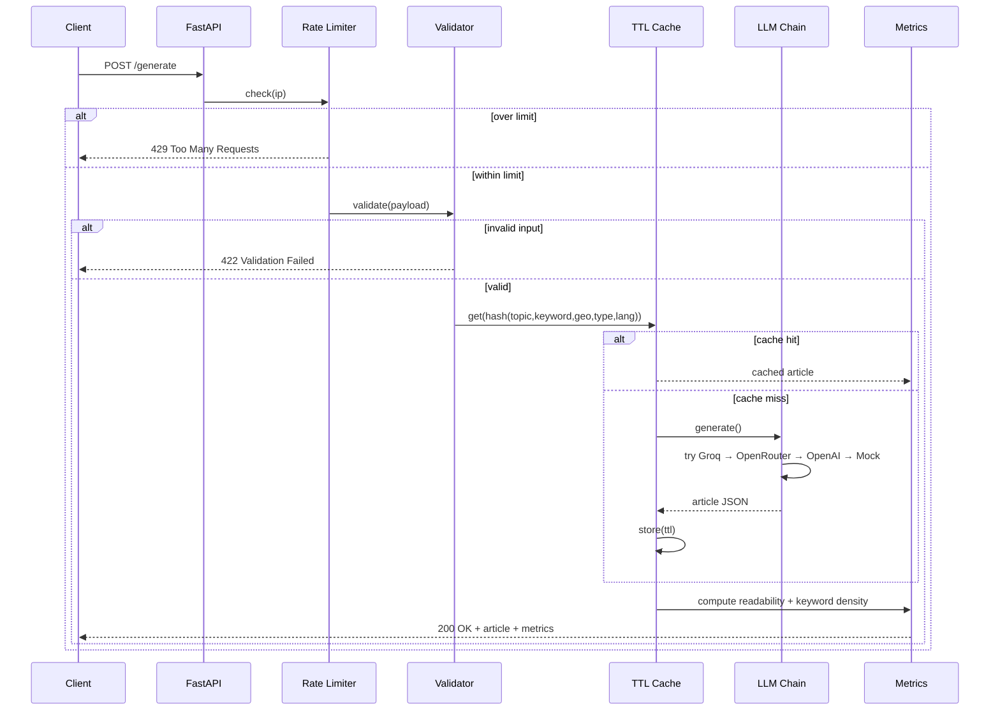

<div align="center">

# 🥗 Healthy Gut AI

**Production-grade AI content engine for medically-grounded, SEO-optimized gut health articles.**

[](https://github.com/Shweta-Mishra-ai/Healthy-Gut-AI/actions/workflows/ci.yml)
[](https://www.python.org/)
[](https://fastapi.tiangolo.com/)
[](https://console.groq.com)
[](LICENSE)
[](tests/)

[Quick Start](#-quick-start) · [Architecture](#-architecture) · [API Reference](#-api-reference) · [Deployment](#-deployment) · [Contributing](CONTRIBUTING.md)

</div>

---

## Overview

Healthy Gut AI takes a topic, a primary keyword, and a geo-target, and returns
a medically-grounded, SEO-structured article — complete with meta description variants,
URL slug, FAQs, JSON-LD schema, readability metrics, and quality scores — in one request.

It's built the way a production content pipeline should be, not the way a
demo usually is:

- **High Concurrency & Load Handling.** Tuned for up to 5,000 users/day with SQLite WAL mode, `busy_timeout=10000`, `synchronous=NORMAL`, and automatic rate-limiter IP memory cleanup.
- **No single point of failure.** A three-provider LLM fallback chain (Groq → OpenRouter → OpenAI → Mock) means one API outage never takes the app down.
- **Fails safely, not silently.** Structured error codes, not generic 500s.
- **Native Language Purity.** Dedicated Devanagari Hindi prompts and rules to eliminate mixed-language output while preserving medical proper nouns.
- **Costs nothing to run at small scale.** Default provider is Groq's free tier; OpenAI is an optional, last-resort fallback you control.
- **Tested, not just written.** 150 automated tests, CI on every push.

<p align="center">
  
</p>

---

## ✨ Features

| Category | Capability |
|---|---|
| **Generation** | Single-article and batch (multi-topic, bounded-concurrency) generation |
| **Topic scoping** | Rejects clearly out-of-scope topics (e.g. "quantum computing") with a clear 422 instead of generating unfocused, off-topic content |
| **Length compliance** | Prompts use per-section word budgets (not a single vague target) for reliable pillar/supporting length adherence; actual word count is surfaced in every response |
| **Quality scoring** | Every article gets a programmatic 0-100 score with specific flags (word count vs. target, keyword placement, meta description length, slug format, FAQ count, readability band, disclaimer presence, **language-script purity for non-English requests**) — not a self-reported LLM claim |
| **Human review** | Every article starts as a `draft`; a reviewer must explicitly approve or reject it (`/review` page) before it's considered publish-ready — no article ships without a human checking the medical framing |
| **Reviewer credential badge** | Approving an article can optionally attach a reviewer name + credential (e.g. "Dr. Anita Rao, MBBS, RMP") — self-attested, stored, shown in the review queue, and appended to the article when publishing to WordPress |
| **High Load & Memory GC** | SQLite WAL mode + busy timeout pragmas, bounded TTL cache, and automatic stale IP key cleanup to prevent memory leaks under 5,000+ requests |
| **Internal linking** | Every new article gets TF-IDF-ranked suggestions to link to previously **approved** articles (`internal_link_suggestions`), for SEO cluster building |
| **WordPress publishing** | Optional REST API integration (`app/cms_wordpress.py`) — publishes **approved** articles only, as WordPress drafts by default, with a dry-run mode to preview the exact payload before any real site is configured |
| **Reliability** | Groq → OpenRouter → OpenAI → Mock fallback chain, each with retry + backoff + timeout |
| **Validation** | Strict Pydantic schemas — length limits, empty/whitespace rejection, unsafe-character rejection |
| **Rate limiting** | Per-IP sliding-window limiter with stale key garbage collection, configurable via `RATE_LIMIT_PER_MINUTE` |
| **Caching** | In-memory TTL cache with active expired key purging — identical requests skip the LLM call entirely |
| **Security & UI** | DOMPurify-sanitized markdown rendering, glassmorphism cards, Google Fonts (`Inter` & `Outfit`), dark/light theme toggle, toast notifications, outline previewer, and copy alerts |
| **Localization** | English and Hindi article generation — native Devanagari rules eliminate language mixing; mock mode has a fully separate Hindi template; programmatic quality checks flag mixed-language output |
| **RAG retrieval** | TF-IDF similarity search over a 24-topic curated gut-health knowledge base — real relevance ranking, not keyword lookup; `/rag/preview` exposes matches + scores |
| **Export** | Download generated articles as `.docx`, `.pdf` (with smart quote & dash sanitization), `.md`, `.json`, or batch `.zip` |
| **Quality metrics** | Flesch Reading Ease + keyword density on every article |
| **SEO metadata** | Meta description (3 A/B-testable variants — benefit-led, question-led, keyword-led), URL slug, FAQs, `schema.org` JSON-LD, dual CTAs |
| **Observability** | Structured request logging, `X-Response-Time` latency header, `/health` reports live provider config + cache stats |
| **Deployability** | Railway (`Procfile`) and Vercel/AWS Lambda (`api/index.py` via Mangum) out of the box |

---

## 🏗 Architecture

<p align="center">
  
</p>

### Request pipeline (flowchart)



### Request lifecycle (sequence)



---

## 🧱 Tech Stack

| Layer | Technology |
|---|---|
| Backend | Python 3.11+, FastAPI, Uvicorn |
| LLM providers | Groq (free), OpenRouter (free tier), OpenAI (optional) — via OpenAI-compatible client |
| Validation | Pydantic v2 |
| Database | SQLite3 with WAL mode, `busy_timeout=10000`, `synchronous=NORMAL` |
| Frontend | Vanilla JS, Marked.js (markdown render), DOMPurify (sanitization), Glassmorphism UI, Theme Switcher, Toast Notifications |
| Export | `python-docx`, `fpdf2` |
| Testing | pytest, httpx, FastAPI `TestClient` |
| CI/CD | GitHub Actions |
| Deployment | Railway (`Procfile`) · Vercel/AWS Lambda (`Mangum`) |

---

## 🚀 Quick Start

### Prerequisites

- Python 3.11 or 3.12
- (Optional but recommended) A free [Groq API key](https://console.groq.com)

### 1. Clone and install

```bash
git clone https://github.com/Shweta-Mishra-ai/Healthy-Gut-AI.git
cd Healthy-Gut-AI/hga
python -m venv venv
source venv/bin/activate        # Windows: venv\Scripts\activate
pip install -r requirements.txt
```

### 2. Configure environment

```bash
cp .env.example .env
```

Edit `.env` — at minimum:

```env
GROQ_API_KEY=gsk_your_key_here
```

> No key set? The app runs in **mock mode** automatically — fully functional
> for local development and demos, zero cost, zero setup.

### 3. Run

```bash
uvicorn app.main:app --reload --port 8000
```

Open **http://localhost:8000**.

### 4. Verify it's healthy

```bash
curl http://localhost:8000/health
```

```json
{
  "status": "ok",
  "mode": "live",
  "providers_configured": { "groq": true, "openrouter": false, "openai": false },
  "cache": { "entries": 0, "max_entries": 500, "ttl_seconds": 3600 },
  "database": { "path": "healthy_gut_ai.db", "reviews": 0 }
}
```

---

## 🔑 Environment Variables

Full reference in [`.env.example`](.env.example).

| Variable | Required | Default | Description |
|---|---|---|---|
| `GROQ_API_KEY` | No* | — | Primary LLM provider, free tier |
| `GROQ_MODEL` | No | `llama-3.3-70b-versatile` | Groq model name |
| `OPENROUTER_API_KEY` | No* | — | Free-tier fallback if Groq is unavailable |
| `OPENROUTER_MODEL` | No | `meta-llama/llama-3.3-70b-instruct:free` | OpenRouter model name |
| `OPENAI_API_KEY` | No | — | Optional paid last-resort fallback |
| `OPENAI_MODEL` | No | `gpt-4o-mini` | OpenAI model name |
| `LLM_TIMEOUT_SECONDS` | No | `45` | Per-attempt timeout |
| `LLM_MAX_RETRIES` | No | `2` | Retries per provider before falling through |
| `RATE_LIMIT_PER_MINUTE` | No | `10` | Requests per IP per minute on `/generate*` |
| `CACHE_TTL_SECONDS` | No | `3600` | How long identical requests are served from cache |
| `MAX_BATCH_SIZE` | No | `10` | Max items per `/generate/batch` call |
| `BATCH_CONCURRENCY` | No | `3` | Concurrent LLM calls within a batch |
| `API_KEY` | No | — | If set, requires `X-API-Key` header on `/generate*`, `/export/*`, `/debug` |
| `DATABASE_PATH` | No | `healthy_gut_ai.db` | SQLite file for review history + dashboard data |
| `WORDPRESS_URL` | No | — | WordPress site URL for publishing (e.g. `https://yoursite.com`) |
| `WORDPRESS_USERNAME` | No | — | WordPress username (existing account) |
| `WORDPRESS_APP_PASSWORD` | No | — | Application Password from WP admin (Users > Profile) |
| `WORDPRESS_TIMEOUT_SECONDS` | No | `15` | Request timeout for WordPress API calls |

*No provider key is required — the app runs in mock mode without any of them.*

---

## 📡 API Reference

| Method | Endpoint | Description |
|---|---|---|
| `GET` | `/` | Frontend UI |
| `GET` | `/health` | Status, active mode, provider config, cache stats |
| `GET` | `/debug` | Lists all registered routes |
| `GET` | `/rag/preview?topic=...&keyword=...` | Shows which knowledge-base chunks are retrieved for a query, with similarity scores |
| `GET` | `/outline?topic=...&keyword=...&article_type=...` | Deterministic outline preview (no LLM call) — planned sections, word budgets, scope check, grounding sources |
| `POST` | `/export/markdown` | Generate (or reuse cache) and return raw `.md` |
| `POST` | `/export/json` | Generate (or reuse cache) and return the full result object as `.json` |
| `GET` | `/dashboard` | HTML dashboard — generation history, quality trends, provider breakdown |
| `GET` | `/dashboard/stats` | JSON dashboard data (same source as the HTML page) |
| `GET` | `/review` | HTML review queue — approve/reject drafts |
| `GET` | `/review/counts` | Draft/approved/rejected counts |
| `GET` | `/review/queue?status=draft` | List articles by review status |
| `GET` | `/review/{id}` | Fetch one article's full review record |
| `POST` | `/review/{id}/approve` | Approve a draft (one-way — 409 if already reviewed) |
| `POST` | `/review/{id}/reject` | Reject a draft (one-way — 409 if already reviewed) |
| `GET` | `/internal-links?topic=...&keyword=...` | Ad-hoc query for related **approved** articles to link to (SEO cluster building) |
| `GET` | `/publish/wordpress/status` | Whether WordPress publishing is configured |
| `POST` | `/publish/wordpress/test-connection` | Verifies configured WordPress credentials work |
| `POST` | `/publish/wordpress/{id}?status=draft&dry_run=false` | Publishes an **approved** article to WordPress |
| `POST` | `/generate` | Generate one article |
| `POST` | `/generate/batch` | Generate up to `MAX_BATCH_SIZE` articles concurrently |
| `POST` | `/export/batch/zip` | Generate (or reuse cache for) a batch and return one ZIP: `.docx` per article + `batch_summary.csv` |
| `POST` | `/export/docx` | Generate (or reuse cache) and return as `.docx` |
| `POST` | `/export/pdf` | Generate (or reuse cache) and return as `.pdf` |

### `POST /generate`

**Request**

```json
{
  "topic": "IBS diet plan",
  "primary_keyword": "IBS diet",
  "geo_target": "India",
  "article_type": "supporting",
  "language": "en"
}
```

**Response — `200 OK`**

```json
{
  "optimized_article_markdown": "# IBS Diet Plan...",
  "meta_description": "Learn about IBS diet with our expert guide...",
  "url_slug": "ibs-diet-plan-guide",
  "faqs": [{ "question": "...", "answer": "..." }],
  "schema_json_ld": { "@context": "https://schema.org", "@type": "Article" },
  "cta_soft": "Explore more free gut health resources...",
  "cta_direct": "Try Healthy Gut AI FREE today...",
  "provider_used": "groq",
  "cached": false,
  "metrics": {
    "readability": { "fleschReadingEase": 62.4 },
    "keywordDensity": { "totalWords": 940, "keywordCount": 12, "keywordDensityPercent": 1.28 }
  }
}
```

**Error responses**

| Status | Meaning |
|---|---|
| `422` | Validation failed — see `details` array for field-level errors |
| `429` | Rate limit exceeded — see `retry_after_seconds` |
| `502` | All LLM providers failed for this request |
| `500` | Unexpected server error |

---

## 🧪 Testing

```bash
python -m pytest
```

150 tests across eighteen test modules (including cache, config, load, security, and export unit tests):

| Suite | Covers |
|---|---|
| `tests/test_metrics.py` | Readability/keyword-density edge cases (empty text, empty keyword, multi-word keywords) |
| `tests/test_cache.py` | TTL cache set/get, max-entries eviction, expiration |
| `tests/test_config.py` | Settings load correctly from environment variables |
| `tests/test_exports.py` | DOCX/PDF byte-level conversion sanity checks and smart quote unicode sanitization |
| `tests/test_schemas.py` | Input validation (length limits, unsafe characters, batch size limits) |
| `tests/test_rag.py` | Retrieval quality — relevant queries rank the correct topic first, fallback grace |
| `tests/test_security.py` | Optional API-key auth (blocked/allowed), disclaimer safety-net |
| `tests/test_scope_and_batch_export.py` | Topic-scope guard (in/out of domain), batch ZIP export contents |
| `tests/test_quality.py` | Programmatic quality scoring — word count, keyword placement, meta length, slug format, FAQ count, script purity |
| `tests/test_load.py` | Concurrent requests under load, bounded batch concurrency, sliding window recovery, stale IP key memory cleanup |
| `tests/test_reviewer_badge.py` | Reviewer credential badge — storage, computed badge text, validation, WordPress publish integration |
| `tests/test_phase2_phase3.py` | Outline preview (in/out of scope), tone field validation, JSON/Markdown export, references section, dashboard stats |
| `tests/test_review.py` | Review workflow — draft registration, queue listing/filtering, approve/reject, 404/409 handling |
| `tests/test_meta_variants.py` | A/B meta description variants — mock generation, safety-net fallback |
| `tests/test_internal_linking.py` | Internal link suggestions — empty corpus, similarity ranking, approved-only filter |
| `tests/test_wordpress_publish.py` | WordPress publishing — mocked HTTP for success/auth-failure/connection-error/timeout, dry-run mode, approved-only rule |
| `tests/test_api.py` | Full request lifecycle in mock mode — health, generation, caching, batching, rate limiting |
| `tests/test_stress.py` | High concurrency stress testing across database writes and memory limits |

CI (`.github/workflows/ci.yml`) runs the full suite on Python 3.11 and 3.12 on every push and pull request.

---

## 📦 Project Structure

```
Healthy-Gut-AI/
├── app/
│   ├── main.py            # App assembly: middleware, exception handlers, health/debug/root, router registration
│   ├── routers/
│   │   ├── generation.py    # /generate, /generate/batch, /export/*
│   │   ├── discovery.py     # /rag/preview, /outline, /internal-links
│   │   ├── review.py        # /review*, /dashboard* (draft/approve/reject workflow)
│   │   └── publish.py       # /publish/wordpress*
│   ├── constants.py        # Shared constants (STATIC_DIR, OUT_OF_SCOPE_MESSAGE)
│   ├── config.py          # Environment-driven settings
│   ├── schemas.py          # Pydantic request/response models
│   ├── llm_providers.py    # Groq → OpenRouter → OpenAI → Mock fallback chain
│   ├── metrics.py          # Readability + keyword density
│   ├── cache.py             # In-memory TTL cache with expired key purging
│   ├── rate_limit.py        # In-memory sliding-window limiter with stale IP key cleanup
│   ├── export.py            # DOCX / PDF generation with unicode text cleaning
│   ├── quality.py           # Programmatic article quality scoring
│   ├── review.py            # Human review workflow (draft/approve/reject), SQLite-backed
│   ├── dashboard.py         # Generation history tracker, SQLite-backed
│   ├── db.py                # SQLite connection + WAL/busy_timeout pragmas
│   ├── internal_linking.py  # TF-IDF-ranked internal link suggestions over approved articles
│   ├── cms_wordpress.py     # Optional WordPress REST API publishing
│   └── rag/
│       ├── knowledge_base.py  # 24-topic curated gut-health corpus
│       └── retriever.py       # TF-IDF similarity retrieval
├── api/
│   └── index.py             # Mangum wrapper for Vercel/AWS Lambda
├── static/                  # Frontend (HTML/CSS/JS with Glassmorphism, Theme Switcher, Toasts)
├── tests/                   # pytest suite (150 passing tests)
├── docs/
│   ├── architecture.svg     # Full pipeline diagram
│   └── pipeline-flow.gif    # Animated request-lifecycle illustration
├── prompts/                 # Reference prompt templates
├── pyproject.toml           # Pytest pythonpath configuration
├── .github/workflows/ci.yml
├── requirements.txt
├── Procfile                 # Railway deployment
├── .env.example
├── CONTRIBUTING.md
└── LICENSE
```

---

## 🌐 Deployment

### Render (primary — see `render.yaml`)

1. Push to GitHub, connect the repo in Render as a new Web Service.
2. Render auto-detects `render.yaml` (build/start commands, default env vars).
3. Add secrets manually in the Render dashboard: `GROQ_API_KEY` at minimum.

### Railway

1. Push to GitHub, connect the repo in Railway.
2. Set environment variables (at minimum `GROQ_API_KEY`) under **Variables**.
3. Railway auto-detects `Procfile` — no further config needed.

### Vercel / AWS Lambda

`api/index.py` wraps the FastAPI app with [Mangum](https://mangum.io/) for
serverless execution — deploy as-is on Vercel's Python runtime or package for
Lambda.

---

## 📤 WordPress Publishing Setup

Optional — the app works fully without it (dry-run mode always works, for
previewing exactly what would be sent).

1. On your WordPress site, go to **Users → Profile → Application Passwords** (built into WordPress 5.6+).
2. Enter a name (e.g. "Healthy Gut AI") and click **Add New Application Password**. Copy the generated code.
3. Set in `.env`:
   ```env
   WORDPRESS_URL=https://yoursite.com
   WORDPRESS_USERNAME=your-wp-username
   WORDPRESS_APP_PASSWORD=xxxx xxxx xxxx xxxx xxxx xxxx
   ```
4. Verify with `POST /publish/wordpress/test-connection` — read-only, safe to call anytime.
5. Only **approved** articles (via the `/review` workflow) can be published; drafts and rejected articles return `409`.

---

## 🤝 Contributing

Contributions are welcome — see [`CONTRIBUTING.md`](CONTRIBUTING.md) for the
local setup, coding standards, and PR checklist.

---

## 📄 License

Released under the [MIT License](LICENSE).

---

<div align="center">

**If Healthy Gut AI was useful to you, please consider giving it a ⭐ —**
**it genuinely helps the project reach more people.**

[](https://github.com/Shweta-Mishra-ai/Healthy-Gut-AI)

</div>
